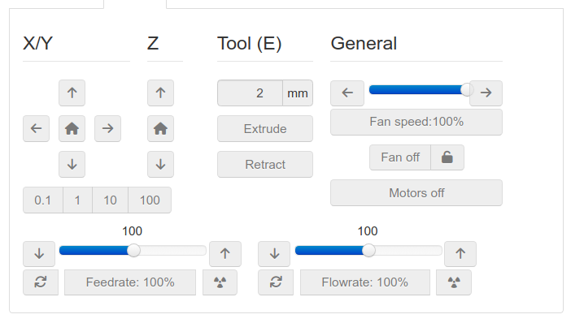
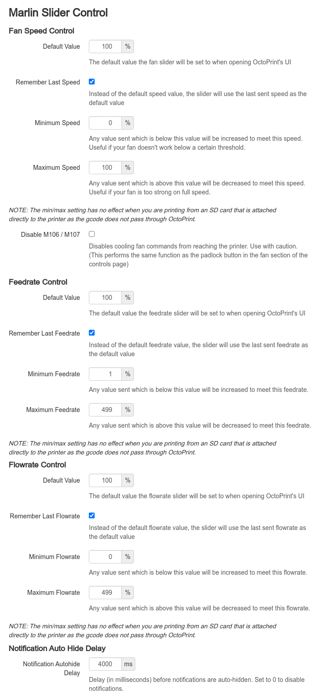

# OctoPrint-MarlinSlider

Add sliders to control the speed of a parts cooling fan, feedrate and flowrate for printers with Marlin firmware.
With version 2 or other firmwares that can report the values, the plugin will report values sent by OctoPrint.

## Usage

Slide the sliders, click the buttons. The Up and Down buttons select the range for the feedrate and flowrate. The arrows will automatically be disabled if changing the range is not possible, i.e. trying to move the range more than by 100%. (You must be able to display the 'current display value' inside the next range. You don't have to send it until you get to the value desired.)

* Notification autohide delay controls how long any notifications will remain on the screen for. If the user manually sets a fan/feedrate/flowrate outside of the set ranges, a notification will be displayed informing the user the setting has been modified. Print jobs shouldn't trigger these notifications, and so popup spam shouldn't occur, however if a user wishes not to receive notifications when setting fan/feedrate/flowrate valurs outside of the set ranges, this value can be set to 0 (zero) to disable notifications. (this setting won't/shouldn't affect OctoPrint's global notifications, it only applies to info popups generated by this plugin).

* *Note: MarlinSlider does not follow the fan speed at all and does not follow the feedrate/flowrate not set through OctoPrint. If the feedrate/flowrate is set via the SD card or an LCD panel on the printer, the slider will not respond to the change. You can update the values using the Checkmark, if not printing from the SD Card.*

## Setup

Install via the bundled [Plugin Manager](https://docs.octoprint.org/en/master/bundledplugins/pluginmanager.html)
or manually using this URL:

    https://github.com/CmdrCody51/OctoPrint-MarlinSlider/archive/master.zip

## ABOUT

This is a fork from the first OctoPrint Fan Speed Slider by NTOFF since the main project is abandoned. Then BERTUGARANGOU's fork that made it compatible with Python 3. And then JNEILLIII who added the xxxx 
I only filled out the two other sliders after Marlin added the responses.
